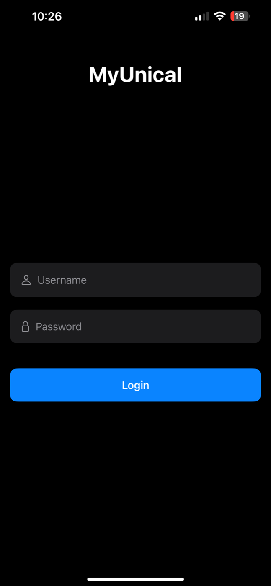
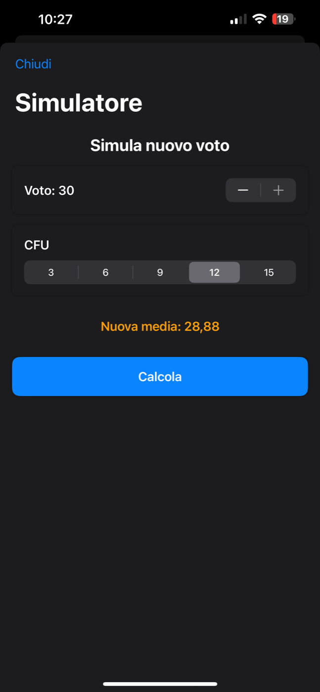

[English](README.md) | **Italiano**

  

<h1 align="center">MyUnical</h1>

  <b>App iOS nativa per gli studenti dell'Università della Calabria (Unical).</b> 
  Libretto, media e CFU, prenotazione esami, tasse e orario settimanale, sopra l'API REST Esse3 dell'Ateneo.

  
  
  
  
  

> [!NOTE]
> Progetto indipendente e non ufficiale, non affiliato all'Università della Calabria. Gli screenshot non contengono
> dati personali.

  
  

## Funzionalità

- **Accesso con le credenziali di Ateneo**, salvate solo nel Portachiavi di iOS.
- **Dashboard** con media ponderata, base di laurea, CFU acquisiti e mancanti e ultimi voti.
- **Simulatore**: come cambia la media con un voto futuro e i suoi CFU.
- **Libretto** con ricerca e **prenotazione degli esami** con data, luogo, ora, presidente, iscritti e note.
- **Tasse**: stato dei pagamenti, fatture con codice di pagamento, importi e scadenze, pagamento con QR e istruzioni
  per ogni metodo.
- **Orario settimanale**: lezioni per giorno con sovrapposizioni, filtro delle lezioni in corso, lezioni
  personalizzate con colori.
- **Offline**: dati in cache JSON visibili senza connessione; aggiornamento silenzioso all'avvio.
- **Localizzata** in italiano, inglese e spagnolo.

## Architettura

- **SwiftUI**, nessuna dipendenza esterna.
- **`NetworkManager`**: client REST di Esse3 (autenticazione, carriera, voti, medie, appelli, prenotazioni, fatture)
  con `async`/`await`.
- **`KeychainHelper`** per le credenziali, **`DataPersistence`** per la cache JSON, **`NetworkMonitor`** per lo
  stato offline.
- Modelli in `Models/`, schermate in `Views/`.

Il prototipo Python usato per esplorare l'API Esse3 prima dell'app è in
[unical-esse3-client](https://github.com/mattmeligeni/unical-esse3-client).

## Compilazione

Apri `MyUnical.xcodeproj` con Xcode 15 o successivo ed esegui su simulatore o dispositivo (iOS 17+). Per accedere
serve un account Unical.

## Licenza

Codice consultabile con la [PolyForm Strict License 1.0.0](LICENSE): si può leggere ed eseguire per scopi non
commerciali; non si può modificare, ridistribuire né pubblicare senza permesso scritto. Nome e icona sono riservati.

---

© 2024-2026 [Mattia Meligeni](https://mattiameligeni.com) · Non affiliato all'Università della Calabria.
